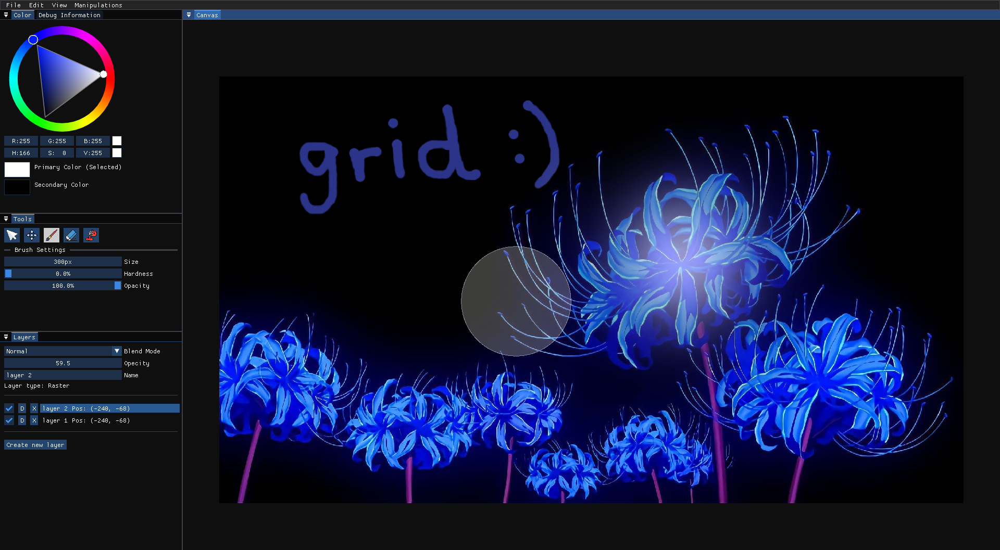

# Grid

An Image Editor that wants to be the best. (Still an incomplete/work-in-progress project)

## Repository Structure
- `src` directory contains all the source code.
- `shaders` contain all the fragment shaders used in grid for filters, tools, blend modes, etc.
- `assets` directory just has a font and some icons for the UI.
- `bin` directory contains the final executable output program along SFML dlls.
- `scripts` directory contains shell scripts, one for compiling ImGui source code (`imgui.sh`) and the other for building the entire editor from scratch (`build.sh`).
- `Makefile` is an alternative to `build.sh` from `scripts`.
- `dependencies` directory has all the libraries' header files and lib files.
    * For now, it has SFML and ImGui (ImGuiFileDialog and dirent are also added for the file chooser).
    * In each library directory there are `lib` and `include` directories (as typically seen). ImGui's directory although contains its entire source code that is to be compiled with `scripts/imgui.sh` into the `lib` folder.
- `obj` directory contains intermediate object files of grid's source code. This is a temporary directory used by the Makefile and is git-ignored.
- `.vscode` folder just has the `launch.json` file that helps in launching `gdb` debugger (if it is installed on your machine). First the `bin/grid.exe` must be present (and compiled with the -g flag), then will the `launch.json` start the debugger (F5 is the shortcut in VS Code, I believe).
- `test_imgs` just contains some images where grid defaults its file dialog's open path. It is just a convenient place to open images quickly and test some features.
- `assets.txt` Contains paths to all the assets and shaders that grid uses.
- `imgui.ini`, used by ImGui to remember grid's UI workspace (positions, sizes, and docking of windows, etc.). It is git-ignored, but will be created automatically the first time grid is launched.

## Building and Running the Entire Program
- On windows, I recommend getting the git bash terminal (or the sh.exe executable) that comes with [git](https://git-scm.com/) to run the scripts.
- First run `./imgui.sh` to compile ImGui source code.
    * This is so that ImGui is first compiled from source code to object files and stored in `dependencies/imgui/lib`. These object files are necessary in the linking stage done so by `Makefile` or `build.sh`.
- Then run one of the following to compile and run the entire program:
    * `make` in the terminal, if you have make installed. `make` uses the `Makefile`.
    * Or `./build.sh`. `build.sh` is good and all but it will recompile everything, and so will take longer to run or test the program.
    * `Note:` Sometimes `Makefile` will not recompile the header files. So when header file is changed, and after running `make` you notice no change (or a bug/crash), then first `make clean` then run `make` again to build freshly.
- `imgui.sh` is just there to automatically compile (only compile not link) the imgui source code. It just automates some manual labour. Probably not that important but is handy.
- `bin` directory will contain the final executable along with SFML dll files to dynamically link us to SFML. The program won't run without these dll files. Note that the source code is written in such a way that the program must be run from the root repository directory, and not inside `bin`. So to run the executable use of `./bin/grid.exe` in a terminal is recommended (Makefile does this automatically with `make` or `make run`).
- Why Cmake or other types of build systems weren't used? Because I've never used them and need to learn them (they seem complicated ;_;).
